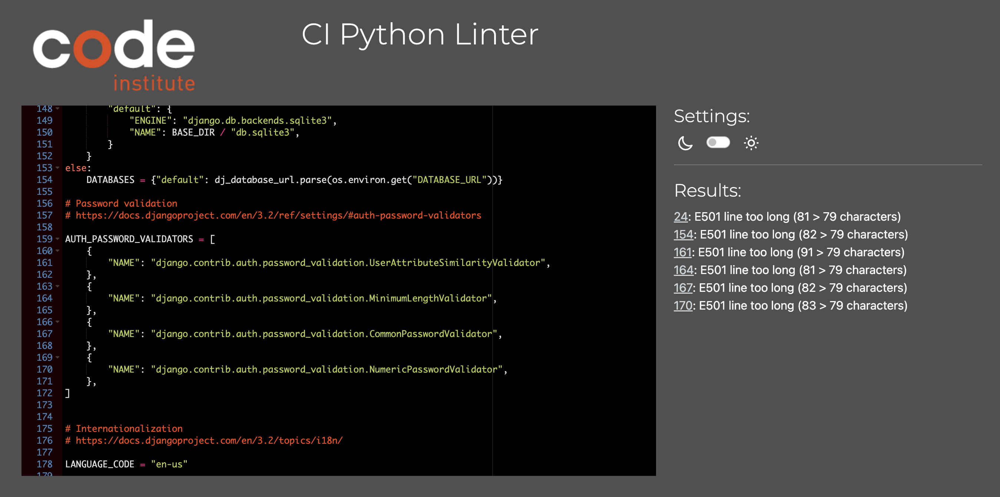

# QuackyGraphy - A Platform For Sharing Your Masterpiece shots!

Quacky-Graphy is a Social Media Platform for Photographers who Loves sharing their amazing shots! The users will be able to say with what type of camera they took the picture and what theme the picture was intended for. For example, Animals, Sport, Nature and many more. Users will be able to see the details of the most, but will not be able to like, comment or post themselves, if they are not logged in. This code is the back-end of the applications, I'd like to say it is the Brains of the website. This is where the front-end of the website will get all the data it needs to function and store information as well.

You Can View the Live Project [Here!](https://pp5-quackygraphy.herokuapp.com/)

## Links to the Frontend Project

- [Frontend - Repository](https://github.com/Quack842/pp5-quackygraphy)
- [Frontend - Deployment](https://pp5-quackygraphy-app.herokuapp.com/)

## Table of Content

1. [User Stories](#user-stories)
2. [Database](#database)
3. [Testing](#testing)
    - [Validation](#validator-errors)
    - [Manual Testing](#manual-testing)
4. [Technologies Used]()
    - [Languages and Frameworks Used]()
    - [Python Modules Used]()
    - [Packages Used]()
    - [Programs and Tools Used]()
    - [Bugs]()
        - [Fixed Bugs]()
        - [Remaining Bugs]()
5. [Deployment]()
    - [Forking the GitHub Repository]()
    - [Making a Local Clone]()
    - [Deploying with Heroku]()
6. [Credits]()
    - [Code]()
    - [Acknowledgements]()

## User Stories
[Back to top ⇧](#quackygraphy---a-platform-for-sharing-your-masterpiece-shots)  
[Table Of Contents ⇧](#table-of-content)

I have included links to the [GitHub Issues](https://github.com/Quack842/pp5-quackygraphy/issues) for this project, as well as the [KANBAN board](https://github.com/users/Quack842/projects/4). There are multiple Coloumns that I added other than the default "Todo", "In Progress" and "Done" and their reason/uses are as follow:
 1. Maybe Add
    - Ideas I got while creating the app I would put in this coloumn. Or Ideas that people have suggested afterwards. The issues places in this column was not a priority and I could work on these after I had time.
2. Buggy
    - This Column was created so I can log any errors or bugs to this issue that I have noticed or what other people have noticed while testing the site for me.
3. Dropped
    - This Column was created for the features I thought I wanted to add, but at the end of the project, decided to drop the issue. Some of the Issues that was also added at the "Maybe Add" was moved to the "Dropped" column.

## Database
[Back to top ⇧](#quackygraphy---a-platform-for-sharing-your-masterpiece-shots)  
[Table Of Contents ⇧](#table-of-content)

## Testing
[Back to top ⇧](#quackygraphy---a-platform-for-sharing-your-masterpiece-shots)  
[Table Of Contents ⇧](#table-of-content)

### Validator Errors:
All python files was passed through the PEP8 validator with no issues. Few long-line error remains in settings.py on the lines shows in the image below:

### Manual Testing
Manual testing was used Though-out the development of the API to discover bugs and issues.

#### Testing Endpoints:
| URL | Passed |
|---|---|
| root route | |
| /profiles/ |  |
| /profiles/\<id>/ |  |
| /posts/ |  |
| /posts/\<id>/ |  |
| /likes/ |  |
| /likes/\<id>/ |  |
| /followers/ |  |
| /followers/\<id>/ |  |
| /review/ (* to be implemented) |  | * to be implemented

